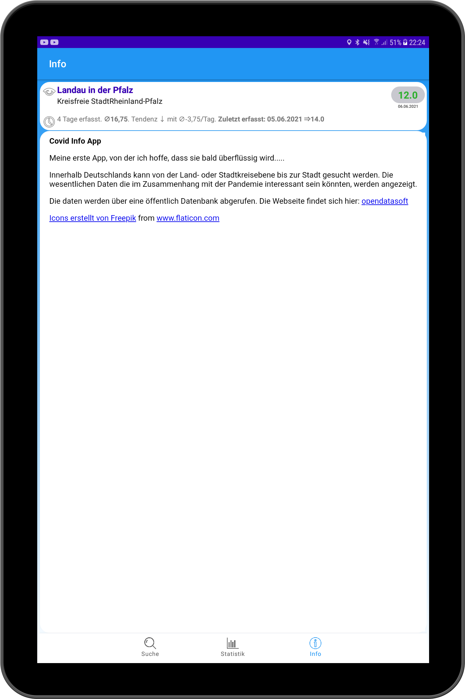
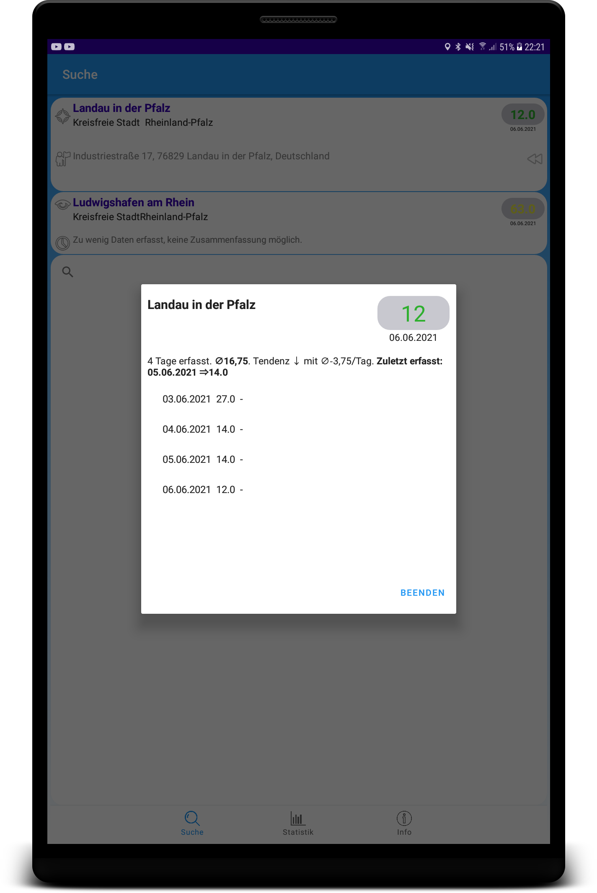

Covid Info Germany
==================
An App which displays the covid related data for ones current location, let's one search an abitrary location in germany or observe any location permanently.

This may be a useful App for some or it may not (depending on how strongly one trusts the data provided), for me it is esentially a training project which I did to improve and extend my programing skills in Android MVVM (Android Architecture Components an the Model, View, View- Model architecture approach).

The app uses an api provided by [Open Data Soft, Covid 19 Pandemic- Germany- Data by Landkreise](https://public.opendatasoft.com/explore/dataset/covid-19-germany-landkreise/api/?q=Karlsruhe&location=11,49.05812,8.41793&basemap=jawg.streets)

